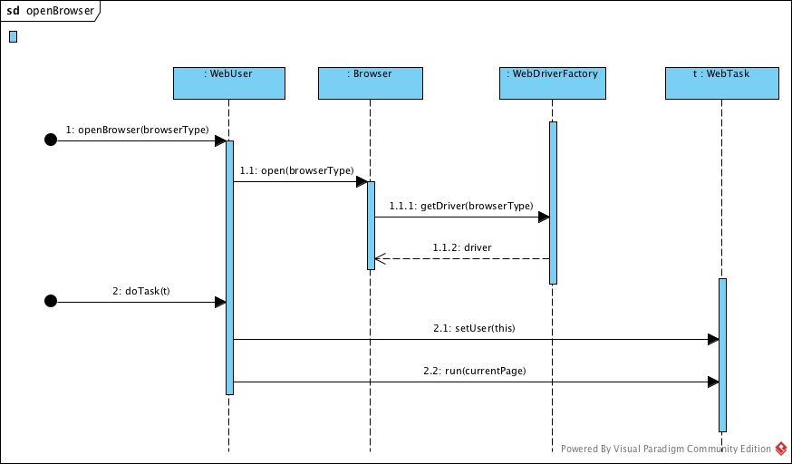
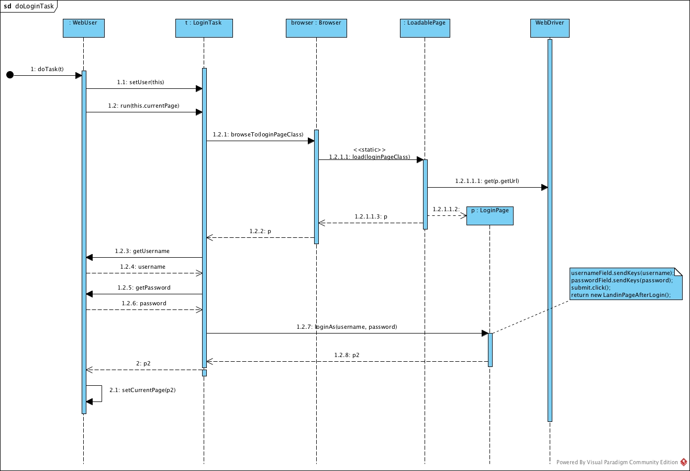

selenium-tinafw
===============

A minimal and effective Selenium framework, not a wrapper.

The goal is two-fold:
- helping manage the mess inherent in a large test suite, by providing a well-defined structure for test code (see [WebTask](http://alb-i986.github.io/selenium-tinafw/javadoc/me/alb_i986/selenium/tinafw/tasks/WebTask.html))
- helping bootstrap a test suite by providing some basic services such as:
  - a factory of WebDriver instances, representing either a local browser or one on a Grid, based on settings in a property file
  - an automatic mechanism to close browsers as soon as a test terminates
  - a mechanism to retry flaky tests
  - test reports with screenshots attached

In order to get an idea of how tests look like by using this framework, please see the [sample provided](https://github.com/alb-i986/selenium-tinafw/blob/master/src/main/java/me/alb_i986/selenium/tinafw/sample/).
Start from [SampleWebTest](https://github.com/alb-i986/selenium-tinafw/blob/master/src/main/java/me/alb_i986/selenium/tinafw/sample/tests/SampleWebTest.java), down to the WebTasks ([OnMyAboutMePage](https://github.com/alb-i986/selenium-tinafw/blob/master/src/main/java/me/alb_i986/selenium/tinafw/sample/tasks/OnMyAboutMePage.java), [Search](https://github.com/alb-i986/selenium-tinafw/blob/master/src/main/java/me/alb_i986/selenium/tinafw/sample/tasks/Search.java), [CanCompliment](https://github.com/alb-i986/selenium-tinafw/blob/master/src/main/java/me/alb_i986/selenium/tinafw/sample/tasks/CanCompliment.java)), down to page objects ([SearchResultsPage](https://github.com/alb-i986/selenium-tinafw/blob/master/src/main/java/me/alb_i986/selenium/tinafw/sample/ui/SearchResultsPage.java), [SearchResult](https://github.com/alb-i986/selenium-tinafw/blob/master/src/main/java/me/alb_i986/selenium/tinafw/sample/ui/SearchResult.java), etc.)

## Usage
Please see the [Tutorial](https://github.com/alb-i986/selenium-tinafw/wiki/Try-it-out) on the wiki.

## Features

- Wraps without wrapping.
  Selenium WebDriver's API is not hidden in any way.
  You could virtually access a WebDriver instance from a test class (although you are encouraged not to do so, unless you want to break cohesion).
  The idea is that _Selenium WebDriver has such a beautiful API that it's a shame to hide it_.

- `WebTask` hierarchy, the orchestrators of page objects:
  - helps keeping your code organized: each concrete WebTask is supposed to be a [Given/When/Then step](http://martinfowler.com/bliki/GivenWhenThen.html))
  - and highly readable ([fluent interface](http://www.martinfowler.com/bliki/FluentInterface.html)): see e.g. [SampleWebTest](https://github.com/alb-i986/selenium-tinafw/blob/master/src/main/java/me/alb_i986/selenium/tinafw/sample/tests/SampleWebTest.java)
  - solves the following problem in an elegant way:

    > Given two tasks that run sequentially, the first does something and ends at a certain page.
    > How can the second task know which was the last page the first task was visiting?
  
    (a naive solution being "every task restarts navigating the SUT from the home page").

- `WebDriverFactory` hierarchy: elegant solution solving the problem of
  creating instances of WebDriver, modeled using the decorator design pattern.

- BDD-style tests are not only supported but also strongly encouraged.
  You can write BDD tests by wrapping your own WebTask's in a `given` `when` or `then` task (each of which is a `CompositeWebTask`).
  See also [WebTasks.BDD](https://github.com/alb-i986/selenium-tinafw/blob/master/src/main/java/me/alb_i986/selenium/tinafw/tasks/WebTasks.java)
  Please see [SampleWebTest](https://github.com/alb-i986/selenium-tinafw/blob/master/src/main/java/me/alb_i986/selenium/tinafw/sample/tests/SampleWebTest.java)
  for an example of usage.
  For an introduction to BDD, please see the article [Introducing BDD, by Dan North](http://dannorth.net/introducing-bdd/).

- HTML reports with embedded screenshots for each failing test, thanks to
  [HtmlReporter](https://github.com/alb-i986/selenium-tinafw/blob/master/src/main/java/me/alb_i986/selenium/tinafw/tests/rules/HtmlReporter.java)
  
- the ability to run each test on many different browsers (or just one)
  by simply setting a property in a file: `tinafw.browsers = chrome, firefox`
  
- the ability to retry a failed test for a given number of times: see [TestRetrier](https://github.com/alb-i986/selenium-tinafw/blob/master/src/main/java/me/alb_i986/selenium/tinafw/tests/rules/TestRetrier.java)
  
- an automatic mechanism for closing browsers as soon as a test finishes,
  as well as the option to disable such a mechanism by setting a property: see [BrowserManager](https://github.com/alb-i986/selenium-tinafw/blob/master/src/main/java/me/alb_i986/selenium/tinafw/tests/rules/BrowserManager.java)

- a clean directory structure, aka multilayered architecture, with:
  - the _tests_ layer, for keeping your test cases along with their data
  - the _domain_ layer, containing concepts like User and Browser, and supposed to contain the concepts
    of your own domain as well, e.g. `BlogPost`, `BlogComment`
  - the _tasks_ layer, containing the orchestrators of page objects
  - the _ui_ layer, with [page objects](https://code.google.com/p/selenium/wiki/PageObjects)

- meaningful logs, e.g.:

		INFO  CompositeWebTask - BEGIN subtask Given
		INFO  CompositeWebTask - BEGIN subtask OnMyAboutMePage
		DEBUG PageHelper$Navigation - Page at URL http://alb-i986.me/ loaded
		INFO  BasePage - Loading page MyAboutMePage
		DEBUG PageHelper - BEGIN Explicit wait (timeout=15s). Waiting until visibility of [[ChromeDriver: chrome on MAC (e8eac3735de18ef7920ce08755d3f6bf)] -> css selector: #profile_box h1.name]
		DEBUG PageHelper - END Explicit wait: visibility of [[ChromeDriver: chrome on MAC (e8eac3735de18ef7920ce08755d3f6bf)] -> css selector: #profile_box h1.name]
		INFO  CompositeWebTask - END subtask OnMyAboutMePage
		INFO  CompositeWebTask - END subtask Given
		INFO  CompositeWebTask - BEGIN subtask When
		INFO  CompositeWebTask - BEGIN subtask Search
		INFO  BasePage - Loading page SearchResultsPage
		DEBUG PageHelper - BEGIN Explicit wait (timeout=15s). Waiting until visibility of [[ChromeDriver: chrome on MAC (e8eac3735de18ef7920ce08755d3f6bf)] -> css selector: #search-results div]
		DEBUG PageHelper - END Explicit wait: visibility of [[ChromeDriver: chrome on MAC (e8eac3735de18ef7920ce08755d3f6bf)] -> css selector: #search-results div]
		INFO  CompositeWebTask - END subtask Search
		INFO  CompositeWebTask - END subtask When
		INFO  CompositeWebTask - BEGIN subtask Then
		INFO  CompositeWebTask - BEGIN subtask CanCompliment
		INFO  CompositeWebTask - END subtask CanCompliment
		INFO  CompositeWebTask - END subtask Then

## A glimpse of the internals: UML Sequence Diagrams

 
## Design goals

- small, clean, Object-based API ([here, quoting Simon Stewart](http://google-opensource.blogspot.ie/2009/05/introducing-webdriver.html))
- not a wrapper
- high cohesion.
- flexibility
- poetry (to be, as well as to allow for)

## Requirements

- Java 8 (see e.g. [LoadablePage](https://github.com/alb-i986/selenium-tinafw/blob/master/src/main/java/me/alb_i986/selenium/tinafw/ui/LoadablePage.java), which makes use of [static methods in interfaces](http://docs.oracle.com/javase/tutorial/java/IandI/defaultmethods.html))
- Maven
- Graphviz

Graphviz is actually optional: it is needed for generating javadocs with pretty cool UML class diagrams (thanks [UMLGraph](http://www.umlgraph.org)!). So you're not gonna need it unless you want to run `mvn site` or `mvn javadoc:javadoc`. 

## Dependencies

The main dependencies are:
- selenium-java
- junit
- log4j

Please see the [POM file](pom.xml) for more details.

## TODO

- redesign Config
- cleanup by leveraging Guice
- add `PageComponent` hierarchy
- make it a data-driven framework
